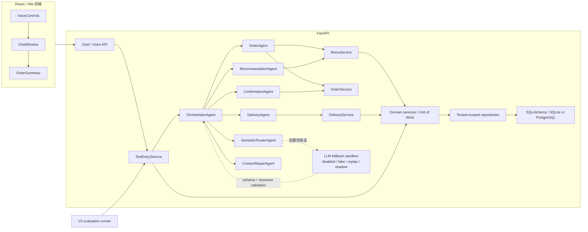

# 系统架构

所有文本和语音请求最终都由 Orchestrator 统一路由、校验和修改状态。子 Agent 不能绕过它提交订单。

关键约束：

- 全局语义优先于当前槽位，fallback 永远最后。
- 菜品、价格和配送费来自服务层。
- shadow 候选不应用到 `SessionState`；live 默认禁用。
- `ConfirmationAgent` 与 Orchestrator 的业务 guard 共同保证提交前确认。
- Agent 和 API 不直接使用 ORM/SQL；repository 负责租户过滤，service 负责事务和生命周期。
- 运行时菜单和 session 以数据库为事实来源；JSON 仅用于 seed/fixture/recovery。
