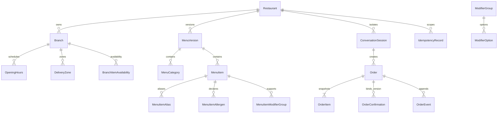

# 阶段 2 领域模型

## 实体关系

## 核心不变量

| 领域 | 关键规则 |
|---|---|
| Restaurant / Branch | restaurant `code` 全局唯一；branch `(restaurant_id, code)` 唯一；active menu 使用组合外键禁止跨餐厅。 |
| MenuVersion | `DRAFT/PUBLISHED/ARCHIVED`；发布是事务；已发布版本经管理服务拒绝修改。 |
| MenuCategory / Item | code 在 menu version 内唯一；item-category 组合外键禁止跨版本；金额为 integer minor。 |
| Translation / Alias | translation 按 entity+locale 唯一；alias 按 version+locale+normalized alias 唯一，不污染其他版本。 |
| Modifier | group 声明必选、min/max、排序和 active；option 加价为 integer minor。 |
| Allergen | 只有 `CONTAINS/MAY_CONTAIN/UNKNOWN`；无声明不得解释为安全；source/verified_at/version 可追溯。 |
| Operations | 营业时段可多段、跨午夜、临时关闭；配送区和售罄都属于 branch。 |
| Session | 首次绑定 restaurant/branch 后不可静默切换；version 乐观并发；closed 不可修改。 |
| Order | 每单只属于一个 branch；金额和 currency 经服务重算；阶段 2 正常流程最远到 `CUSTOMER_CONFIRMED`。 |
| Snapshot | OrderItem 保存 item code/name/unit price/modifier/allergen/menu version 快照，不被新菜单改写。 |
| Confirmation | confirmation 绑定 `draft_version` 和 fingerprint；旧版本、其他 session 或问句不能确认。 |
| Event / Idempotency | event `(order_id, sequence)` 唯一且追加；key 按 restaurant+branch+scope 隔离，同 key 不同 fingerprint 冲突。 |

Customer 仅保存最小 synthetic 字段。当前对话必需的 synthetic 电话/地址放在独立 `ConversationContactSnapshot`，不放在普通 session JSON、OrderEvent 或常规日志。本阶段未建立生产加密或法定保留期，因此不得写入真实电话和地址。
